# Proyecto6-ETL

### Temas

- [Introducción](#introducción)
- [Herramientas](#herramientas)
- [Procesamiento](#procesamiento)
- [Webscrapping ](#webscrapping)
- [Tablas de Hecho y de Dimensiones](#tablas_de_hecho_y_de_dimensiones)
- [Pipeline](#Pipeline)
- [Conclusiones](#Conclusiones)
- [Recomendaciones](#Recomendaciones)
- [Recursos](#Recursos)

## Introducción
......

### Objetivo

## **Herramientas**
  1. Google BigQuery
  2. Google Colab
  3. Tableau
  4. Visual Studio
  5. LucidChart
  6. MySQL

## **Procesamiento**

Tabla: superstore

**1. Nulos**

>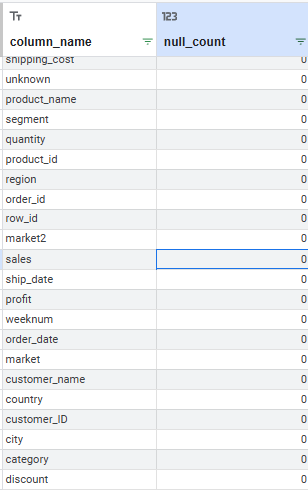

[Consulta BigQuery](SQL/Nulos)

**2. Duplicados**

Se revisan los duplicados de manera general por columna, obteniendo los siguientes resultados:

>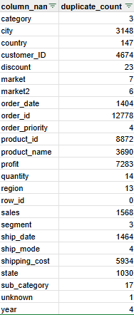

Duplicados con sus multiples concurrencias:

>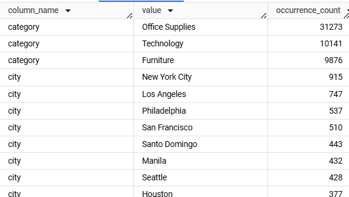

Duplicados con variables coincidentes:

* Identificador de Pedido y Producto: Cada producto en un pedido debe tener una entrada única. Si un producto aparece más de una vez con el mismo order_id, podría ser un error o duplicado.
* Pedido y Cliente: Cada pedido es único para un cliente y no debe repetirse con la misma combinación de order_id y customer_id, a menos que sea un error.
* Pedido, Producto y Fecha: Verifica si el mismo producto fue pedido varias veces en la misma fecha bajo el mismo pedido, lo cual podría ser un duplicado no deseado.
* Pedido Completo: (order_id, product_id, customer_id, order_date, quantity) Esta verificación asegura que no existan filas duplicadas que representen el mismo pedido, producto, cliente y cantidad en la misma fecha.

>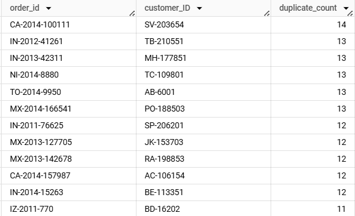

>>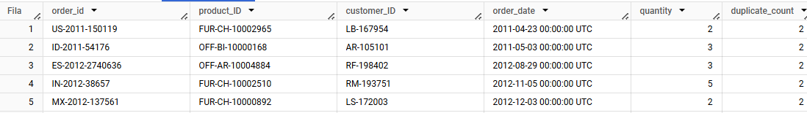

[Consulta BigQuery](SQL/Duplicados)

**3. Outliers en variables categóricas y númericas** 

No se detectarón Outliers en el Data frame, se normalizan los datos al utilizar LOWER para convertir todos los valores "objects" en minúsculas.

[Consulta BigQuery](SQL/Outliers)

## Webscrapping 

Se extrajo la tabla de "Multinacional" de la pagina web [Wikipedia](https://en.wikipedia.org/wiki/List_of_supermarket_chains) para incluir a los competidores en el estudio.

Se realiza limpieza y normalización del data set.
  * Eliminación de simbología.

  * Revisión de nulos y duplicados.

[Consulta Colab](Python/P6_ETL_Exploración.ipynb)

[Consulta Bigquery](Python/P6_ETL_Exploración.ipynb)

## Tablas de hecho y tablas de dimensiones

Diseño de la estructura de tablas:

[Diseño LucidChart](https://lucid.app/lucidchart/2d233643-71af-4b4e-84eb-2e13a9e5aae1/edit?viewport_loc=-1948%2C-274%2C2409%2C1111%2C0_0&invitationId=inv_bc08195d-98b3-498f-9f3c-ea351374ea43) 

**Diagrama**
>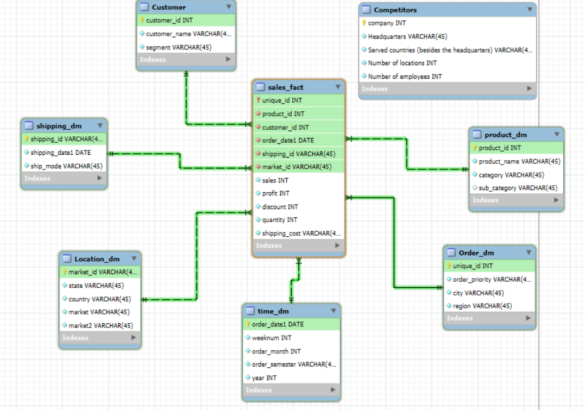

El proceso de diseño de las tablas de dimensiones en este modelo relacional siguió un enfoque estructurado para garantizar que las transacciones registradas en la tabla de hechos puedan ser analizadas de manera detallada y eficiente. Este enfoque se centró en la correcta segmentación de los atributos descriptivos y cuantitativos, asegurando una adecuada normalización de los datos, lo que facilita consultas analíticas eficientes y escalables.

**1. Identificación de las Dimensiones Relevantes:**

El primer paso consistió en identificar las entidades clave que describen los hechos (ventas, envíos, etc.). Estas entidades se agrupan en las siguientes dimensiones:

  **- Customer_dm:** Esta dimensión almacena los atributos descriptivos de los clientes, lo que permitirá el análisis de las transacciones según las características de los clientes.

  **- Product_dm:** Contiene los detalles descriptivos de los productos vendidos, con la finalidad de analizar las ventas pot tipo de producto y categoría.

  **- Order_dm:** Describe las órdenes realizadas por los clientes y contiene métricas asociadas, con la finalidad de dar contexto sobre las métricas transaccionales.

  **- Time_dm:** Proporciona contexto temporal para los hechos, desglosando las fechas en unidades útiles, para permitir el análisis de tendencias temporales, y el desglose por semana, mes, trimestre y años.

  **- Shipping_dm:** Almacena información sobre los detalles del envío, con el proposito de analizar la eficiencia y los costos relacionados con el envío.

  **- Market_dm:** Describe los mercados donde operan las venta, permite análisis de ventas por mercados y submercados

  **- Competitor_dm:** Describe los diversas compañias y sus distintas localizaciones, aunque esta tabla no esta relacionada directamente con nuestra tabla de hechos, permitira realizar comparaciones o analisis de competidores.

**2. Conexión con la Tabla de Hechos:**

La tabla de hechos está relacionada con cada dimensión mediante claves primarias (PK) y claves foráneas (FK). Por ejemplo:

* unique_id (PK) conecta con order_dm.
* product_id (FK) conecta con la Product_dm.
* customer_ID (FK) conecta la tabla de hechos con customer_dm.
* order_date_formatted (FK) conecta con time_dm.
* shipping_ID (FK) conecta con shipping_dm.
* market_id (FK) conecta con market_dm.
* sales: Monto total de la venta.
* profit: Beneficio generado por el pedido.
* discount: Descuento aplicado al pedido.
* quantity: Cantidad de productos pedidos.
* shipping_cost: Costo de envío.

Estas relaciones permiten consultas multidimensionales donde se puede analizar, por ejemplo, las ventas totales por cliente, el impacto de los modos de envío en las ganancias, o las tendencias de ventas por mercados y categorías de productos.

**3. Creación de Atributos Calculados en las Dimensiones:**

Además de las relaciones entre las tablas, se calcularon atributos como el número de mes (order_month) y el semestre (order_semester) en la dimensión de fechas, para facilitar análisis temporales más detallados. Esto permite análisis estacionales, de trimestres y semestrales.
Así como tambien Id´s únicos en order_id, market´s y shipping.

**4. Validacion del modelo**

Se realizó proceso de validación del modelo de datos diseñado para el análisis de ventas, con el fin de garantizar la correcta segmentación y análisis de las transacciones registradas en la tabla de hechos (sales_fact). El modelo sigue un enfoque estructurado basado en la conexión con las dimensiones relevantes (clientes, productos, órdenes, tiempo, envíos y mercados), permitiendo un análisis detallado de las métricas clave de ventas, costos y beneficios.

Para garantizar la integridad de las relaciones entre la tabla de hechos y las dimensiones, se ejecutaron diversas consultas para validar las siguientes relaciones clave:

**Sales_table - Order_ dm**

>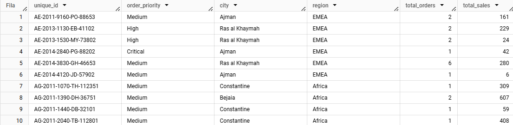

- La relación entre la tabla de hechos y la dimensión de Órdenes se validó mediante una clave única que combina los identificadores de órdenes y clientes. Se examinaron atributos como la prioridad de la orden y la ubicación de la transacción para asegurar la correcta vinculación de la información. Se verificaron métricas clave como el número total de órdenes y las ventas totales para cada orden única, asegurando la precisión de las relaciones entre tablas. Además, se realizó un análisis por región y ciudad para identificar tendencias de ventas, destacando la capacidad del modelo para ofrecer insights geográficos precisos.

**Facts_table - Customer_id**

>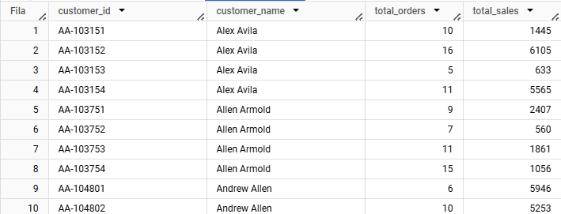

-Se llevó a cabo una consulta que enlaza la tabla de hechos con la dimensión de clientes para verificar la relación entre los customer_id presentes en ambas tablas. Se examinaron atributos clave como la relación entre customer_id y customer_name para asegurar que las transacciones se asignen correctamente a los clientes. Además, se validaron el número total de órdenes y el monto total de ventas por cliente, garantizando la precisión de los cálculos y la correcta vinculación con la información descriptiva de cada cliente.

El análisis por cliente permitió identificar tendencias de ventas y el comportamiento de compra a nivel de cliente. Por ejemplo:

* Alex Avila realizó 10 transacciones con ventas totales de 1,445, mientras que en otra transacción con diferente customer_id, realizó 16 transacciones con ventas totales de 6,105.
* Allen Arnold y Andrew Allen también mostraron múltiples transacciones con diferentes volúmenes de ventas, lo que permite una visión integral de sus actividades de compra.

**Facts_table - Product_dm**

>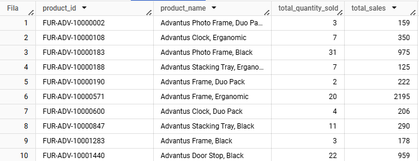

-Se realizó una consulta que enlaza la tabla de hechos con la dimensión de productos para verificar la correspondencia entre los product_id y los nombres de los productos. Esta consulta asegura que cada transacción esté correctamente asociada con el producto correspondiente. Además, se calcularon las métricas clave, como el total de productos vendidos y las ventas totales por producto.

* El análisis permite identificar productos con alto rendimiento de ventas, como el Advantus Frame, Ergonomic, que registró 20 unidades vendidas con un total de 2,195 en ventas. También se observan productos con menor volumen de ventas, como el Advantus Frame, Duo Pack, que tuvo 2 unidades vendidas y un total de 222 en ventas.

**Facts_table - time_dm**

>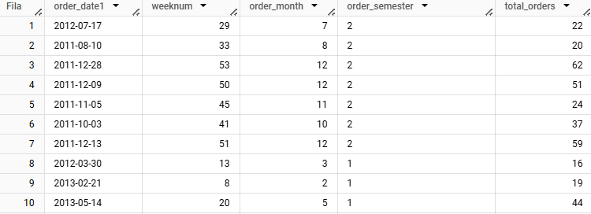

-Se llevó a cabo una consulta que enlaza la tabla de hechos con la dimensión de tiempo para verificar la relación entre las fechas de orden (order_date1) y las unidades temporales como el número de semana, el mes y el semestre. Esta consulta valida que cada fecha de orden esté correctamente asociada con sus atributos temporales, lo cual es esencial para los análisis temporales y la identificación de patrones. Además, se calculó el número total de órdenes por cada fecha de orden, asegurando que las órdenes estén correctamente agregadas y vinculadas con las unidades de tiempo relevantes.

El análisis temporal proporciona información valiosa sobre las tendencias de órdenes a lo largo del tiempo. Por ejemplo:

* Las semanas y meses cercanos a fin de año, como diciembre de 2011, muestran un número mayor de órdenes, lo que sugiere un aumento en las ventas durante el último trimestre del año.
* El primer semestre de 2013 también muestra actividad significativa, como se puede observar en la fecha 14 de mayo de 2013 con 44 órdenes.

**Facts_table - shipping_dm**

>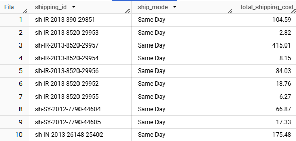

-Se ejecutó una consulta para unir la tabla de hechos con la dimensión de envíos, verificando la relación entre los shipping_id y los modos de envío, así como los costos de envío acumulados. Se validaron aspectos clave como la relación entre shipping_id y ship_mode, y se calculó el costo total de envío por cada shipping_id para asegurar la precisión en los análisis de costos logísticos.

**Facts_table - location_dm**

>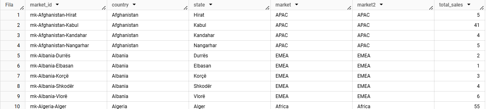

-Al realizar esta consulta, se asegura que cada market_id esté correctamente asociado con su país y estado correspondientes, así como con los mercados principales y secundarios, lo cual es esencial para contextualizar geográficamente las ventas. Además, se calculó el total de ventas por cada market_id, garantizando que las métricas estén correctamente agregadas a nivel de ubicación geográfica, facilitando así el análisis del rendimiento de las ventas por país, estado y mercado.

**Facts_table**

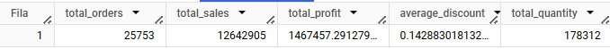

Se llevó a cabo una validación de la tabla de hechos mediante el cálculo de métricas globales para asegurar la coherencia de los datos y la precisión en el procesamiento de transacciones. Las métricas clave validadas fueron:

* Total de órdenes: 25,753, representando el número total de transacciones registradas.
* Ventas totales: 12,642,905, reflejando el valor total de las ventas en el período analizado.
* Beneficio total: 1,467,457.29, indicando las ganancias acumuladas después de deducir los costos.
* Descuento promedio: 0.14, equivalente a un 14.3% de descuento promedio por transacción, evaluando su impacto en las ventas y beneficios.
* Cantidad total de productos vendidos: 178,312, mostrando el volumen total de productos procesados y la demanda.

## Pipeline

>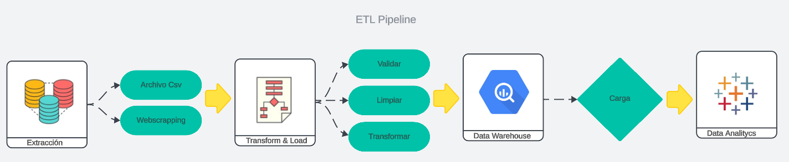

Proceso ETL Pipeline:
* Extracción: Recolecta los datos desde las fuentes, ya sea bases de datos, archivos CSV o web scraping.
* Transform & Load: Los datos se transforman parcialmente y se cargan en un almacenamiento temporal o tabla staging. Los datos son validados (sin duplicados ni valores nulos), limpiados, y transformados para generar campos adicionales y asegurar la calidad.
* Data Warehouse: Los datos transformados se almacenan en BigQuery, organizados en las tablas de hechos y dimensiones.
Las transformaciones adicionales se aplican en BigQuery para preparar los datos finales para su consumo.
* Data Analytics: Los datos se visualizan y analizan en herramientas de BI como Tableau para la toma de decisiones.
* Programación: La carga de datos se realiza de manera diaria para el correcto análisis de los datos.

[Diseño LucidChart](https://lucid.app/lucidspark/03a4adc1-525f-452b-bf2e-8d1d5c15b3b0/edit?viewport_loc=550%2C2882%2C2976%2C1408%2C0_0&invitationId=inv_ace70aa1-ca5f-465a-bd7d-ac0b5b00fe96) 

## Análisis exploratorio

El objetivo principal del análisis exploratorio fue obtener insights valiosos a partir de los datos de ventas y operaciones contenidos en las tablas de hechos y dimensiones. El análisis se centró en visualizar las relaciones entre diferentes variables categóricas y numéricas para identificar patrones, tendencias y anomalías. A continuación se describen los pasos clave seguidos en este proceso:

[Diseño Tableau](https://lucid.app/lucidspark/03a4adc1-525f-452b-bf2e-8d1d5c15b3b0/edit?viewport_loc=550%2C2882%2C2976%2C1408%2C0_0&invitationId=inv_ace70aa1-ca5f-465a-bd7d-ac0b5b00fe96) 

### 1.- Hipótesis 

### 2.- Hipótesis

### 3. Hipótesis 

### 4. Hipótesis 

### 5. Hipótesis 

### 6 . Hipótesis 

[Consulta Python](Colab/P4_AnalisisExploratorio.ipynb).

## Riesgo Relativo

 [Consulta Colab](Colab/P4_RiesgoRelativo.ipynb)

## **Análisis de Significancia Estadística**

 [Consulta Colab](Colab/P4_Significancia.ipynb)

## **Regresión líneal**

  [Consulta Colab](Colab/P4_RegresionLineal.ipynb)

## **Regresión logística**

  [Consulta Colab](Colab/P4_RegresionLogistica.ipynb)

### **Conclusiones**

### **Recomendaciones**

## **Dashboard**

Tableu 1era parte [aquí](https://public.tableau.com/app/profile/teresa.alejandra.martinez.vargas/viz/DataLab-amazon1/Dashboard1?publish=yes)

Tableu 2da parte [aquí](https://public.tableau.com/app/profile/teresa.alejandra.martinez.vargas/viz/DataLab-amazon/Dashboard2?publish=yes)

## Presentación del Proyecto 
Loom [aquí](https://www.loom.com/share/a60c807883a440969666e495dd5edefd?sid=874872a1-fdb7-49c8-86c0-182cfc36f778)

PDF [aquí](https://drive.google.com/file/d/1CUbB37qTPLpsM2heo-EqDjsKOdm8zJJI/view?usp=sharing)
